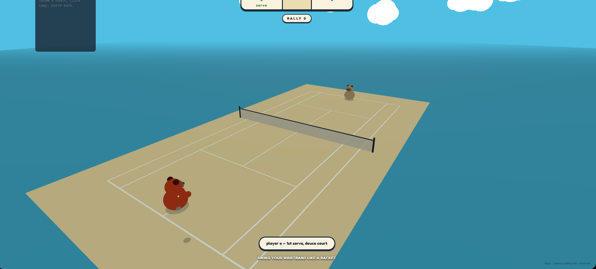
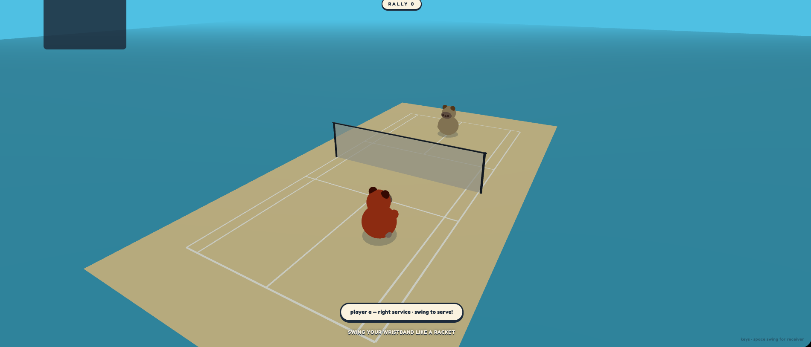
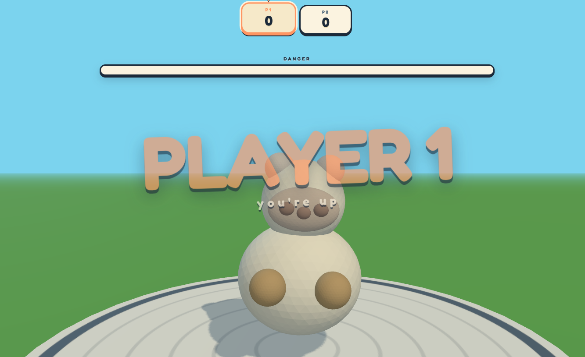

# Soup Sports

Nothing like spending your last days on Earth soup! I mean just look at him!!

## Minigames
### Boxing

Fight soup


### Tennis 

Fight each other in this classsic ball sport! 



### Badminton

Like tennis but Asian! For those wanting a slower 




### Ping Pong

Like tennis but smaller! For people wanting a quicker reflex game. 


### Soup Ninja 

Like fruit ninja but avoid cutting soup D:


### Soup Bomb

Try to beat soup as many times before he get angi D:<



## Architecture

```
   ┌─────────────┐         ┌─────────────┐
   │  wristband  │         │  wristband  │     XIAO ESP32-S3 (or C3)
   │   (any)     │         │   (any)     │     + MPU6500 IMU
   │  ▄▄▄▄▄▄▄▄▄  │         │  ▄▄▄▄▄▄▄▄▄  │     + LiPo
   └──────┬──────┘         └──────┬──────┘
          │                       │
          │   ESP-NOW broadcast   │             2.4 GHz, channel 1
          │   200 Hz IMU samples  │             no pairing, no Wi-Fi
          │                       │
          └───────────┬───────────┘
                      ▼
              ┌───────────────┐
              │    dongle     │                 XIAO ESP32-S3
              │   (USB CDC)   │                 no sensor
              └───────┬───────┘
                      │  serial CSV
                      ▼
              ┌───────────────┐
              │    browser    │                 Chromium, Web Serial
              │  Three.js UI  │                 six minigames
              └───────────────┘
```

- **Wire format**: `arm_id, t_us, ax, ay, az, gx, gy, gz, roll, pitch\n`
  Newline-terminated ASCII. `arm_id` is the low 16 bits of the chip's WiFi MAC — chip-unique, no compile-time provisioning.
- **`classifier.js`** — streaming state machine with gravity-aligned features. Snapshots the "up" axis at swing start so mid-swing wrist rotation doesn't confuse it. Emits `jab` or `block` events with a normalized power (0-1).
- **`pairing.js`** — first wristband to shake claims slot A, second claims slot B. Persisted in sessionStorage across game switches.
- **`dispatch.js`** — routes samples to per-arm classifiers, forwards events to whatever game is running.
- **Six games** — self-contained HTML files, one per game. Import the four shared modules (`serial.js`, `dispatch.js`, `classifier.js`, `pairing.js`, `sfx.js`, `loader.js`). No build step, no framework.

## How to run

```bash
# 1. Flash the firmware. One binary, works on any wristband — the arm_id
#    derives from the chip's MAC at boot.
cd day3/firmware
pio run -e wrist  -t upload --upload-port /dev/ttyACM0   # S3 wristband
pio run -e wrist_c3 -t upload --upload-port /dev/ttyACM0 # C3 wristband
pio run -e dongle -t upload --upload-port /dev/ttyACM0   # dongle

# 2. Start the browser side.
cd day3/app
python3 -m http.server 8123
# open http://localhost:8123 in Chromium (needs Web Serial)

# 3. Click "connect hub", pick the dongle's /dev/ttyACM* port, wave a
#    wristband. It claims slot A. Wave another one to claim slot B.
#    Pick a game from the grid.
```

## Devlog

Rambling on our adventure, mess ups, frustrations, crash outs, etc 

The first initial challenge was the classifier. Finding position on an accelerometer requires integrating twice, which can very easily rack up errors.

So in order to detect gestures, we needed to look at spikes in rotations or accelerations. But then we face another problem: depending on hwo the user twists their wristis, up can become down, left can be right. We don't have a magnetomter, so our solution was to implement gravity tracking to give it some reference. So now our gestures can be 
"against gravity" for uppercuts, or "perpendicular to gravity" for jabs. It polls at 200 MHz, making it very accurate.

Carying around a long wire to plug into the laptop wouldn't be very convenient, so we wanted to do some kind of wireless communication between ESPs. Luckily, ther was the [ESP NOW](https://docs.espressif.com/projects/esp-now/en/latest/esp32/) protocol that we could use for extremely past, ESP-to-ESP communication.

The dongle is just a dumb little forwarder: it takes the packets and just forwards them over Serial for our application to use. This is because we realized how slow flashing to ESP was :(, and we wanted to improve our iteration speed

The thresholds weren't guessed. We build a Python collector that triggers on peak detection and then running it through statistica analysis to see which are features, and which are just noise. 

Next up, we wanted to turn ours into PVP. Our solution to identifying is just using the MAC address as a unique idenitfier, and appending it to packets. This way, no "A" / "B" needs to be provisioned or set at flash time, making it one universal firmware.
