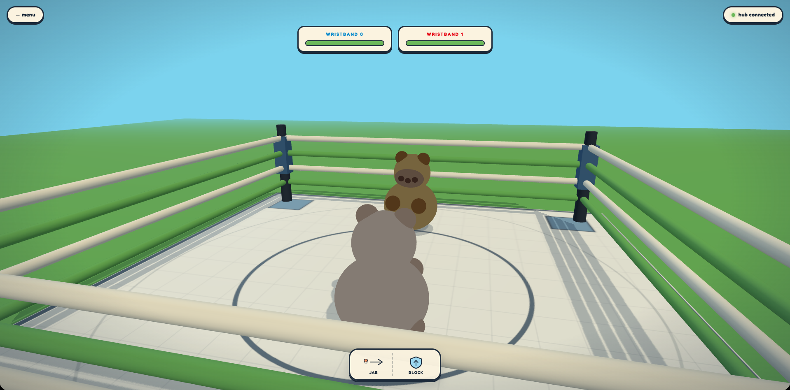
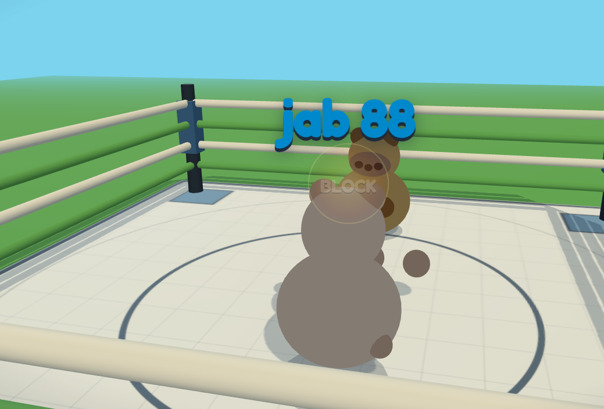
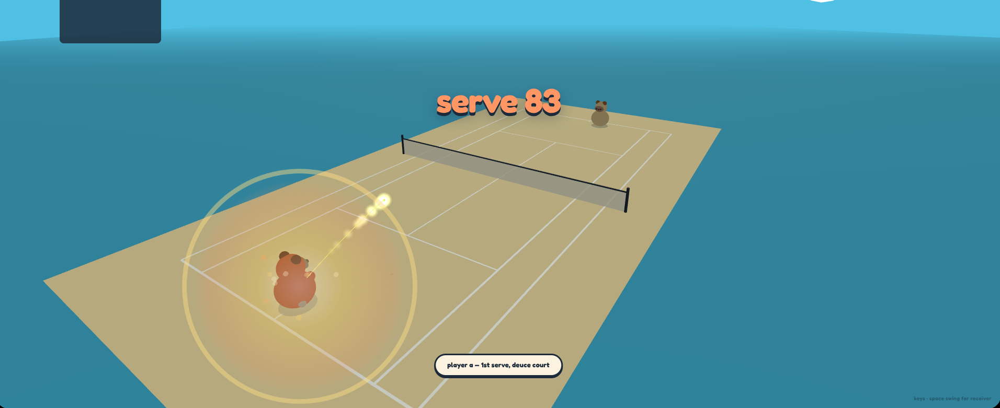
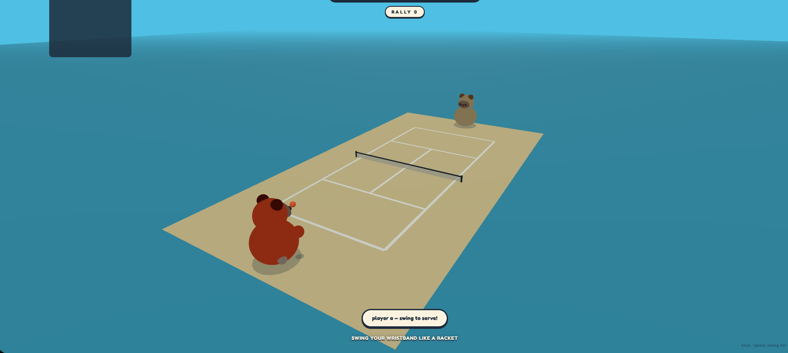
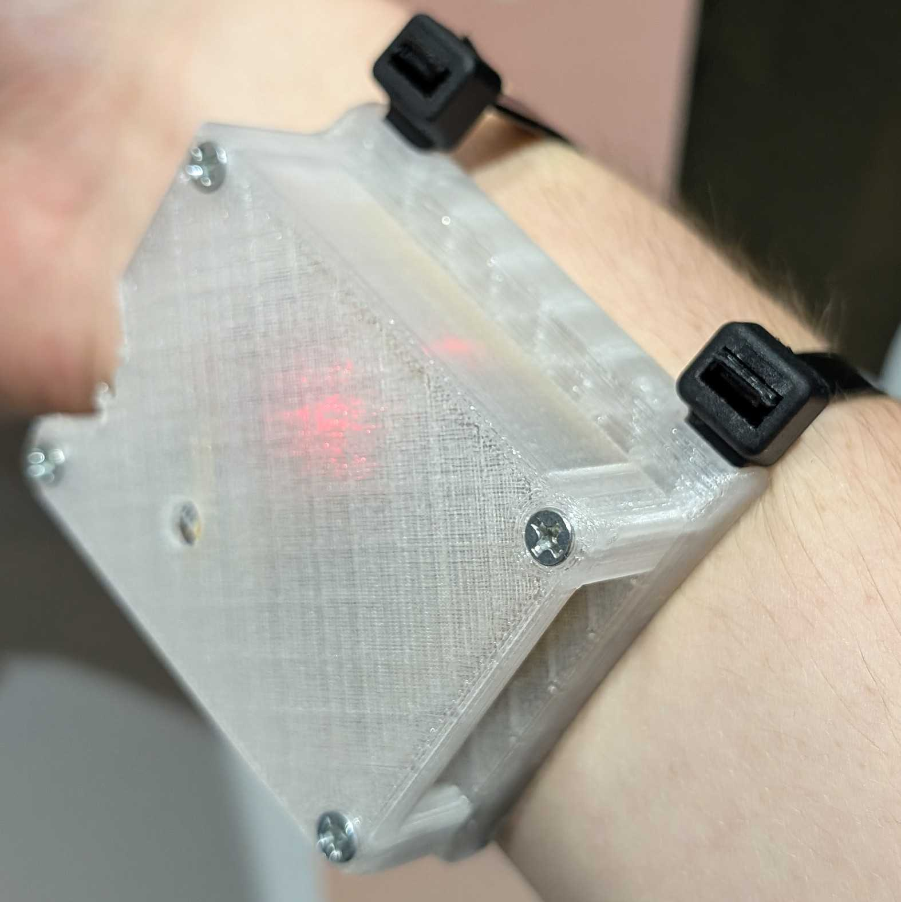

# Soup Sports

Nothing like spending your last days on Earth soup! I mean just look at him!! 

## Inspiration

We loved the Wii Sports minigames, but unfortunately as a child, we were only able to play them at that rich friend's house. But now, in the hardware capital of the world, we're able to get microcontrollers tens of times more powerful for dirt cheap. So we thought... why not make a dirt cheap and dead simple Wii Sports controller? 

## What is it? 

It's really just a Xiao ESP32-C3, an MPU 6050 in a wristband form factor. It also has a dongle to receive the wireless transmission! 

## Minigames

### Boxing

Fight soup





### Tennis

Fight each other in this classic ball sport!




### Badminton

Like tennis but Asian! For those wanting a slower game.


### Ping Pong

Like tennis but smaller! For people wanting a quicker reflex game.



### Soup Ninja

Like fruit ninja but avoid cutting soup D:


### Soup Bomb

Try to beat soup as many times before he get angi D:<


## Hardware

Soup Sports is played using motion trackers made of a Seeed Studio Xiao ESP32 C3 and an MPU 6050 accelerometer. The tracker is powered using a 1500mAh LiPo cell, managed by the ESP. The tracker is mounted inside a 3D printed case mounted onto the users arm, just below the wrist. It mounts easily using wide zip ties, but is designed for velcro or other reusable methods that insert into the gap and easily stay there.



https://cad.onshape.com/documents/96dfd435d5d173795bd096b8/w/c7c34e918390195d74f79421/e/89e02144e4e3d73eefe35443

### Wiring 


## How to run

We had both the S3 and C3 chips available, so there are two versions of the wrist firmware

```bash
cd firmware
pio run -e wrist    -t upload --upload-port /dev/ttyACM0
pio run -e wrist_c3 -t upload --upload-port /dev/ttyACM0
pio run -e dongle   -t upload --upload-port /dev/ttyACM0

# 2. Start the browser side.
cd ../app
python3 -m http.server 8123
# http://localhost:8123 in Chrome (needs Web Serial, not supported in other browsers)
```
